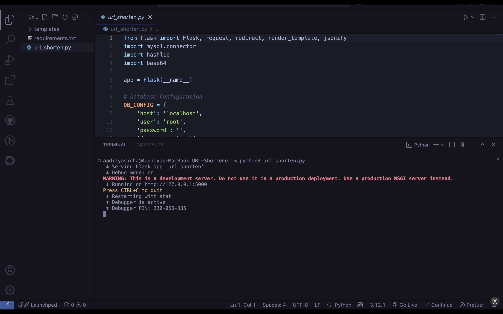
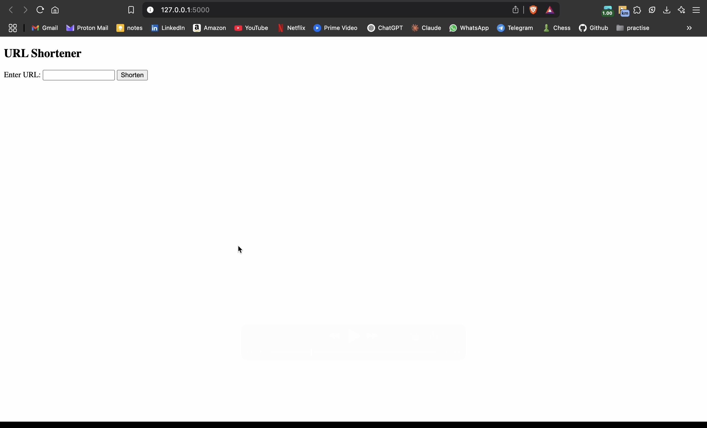
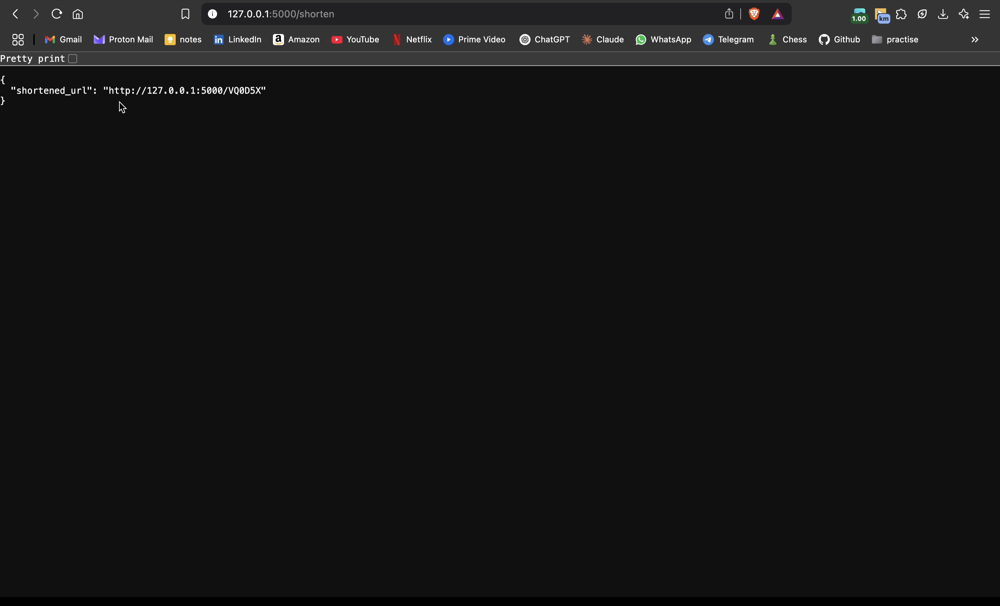
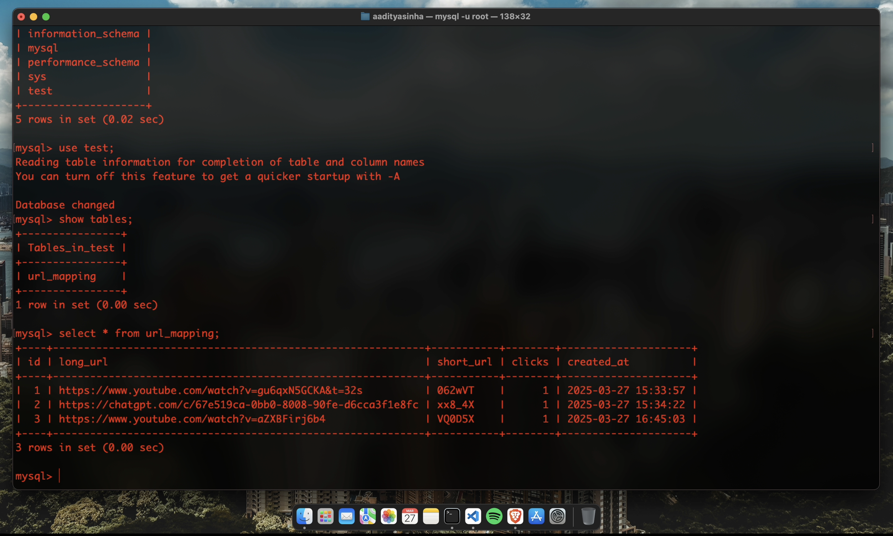

# URL-Shortener 
***

URL Shortener is a simple web application built using Flask and MySQL to generate short links from long URLs. It provides fast redirection, analytics tracking, and an easy-to-use interface. The backend is powered by FastAPI and Flask, while HTML is used for the frontend. 
The project is designed for efficient URL storage and retrieval, ensuring high performance. 

### Tech Stack & Tools Used
***
- **Backend:** Python (Flask)
- **Database:** MySQL
- **Frontend:** HTML 
- **Hashing Algorithm:** SHA-256 & Base64
- **Analytics:** Click Tracking
- **Hosting (Future Considerations):** AWS EC2

### Database Schema

***

 Table  `url_mapping`

```sql
CREATE TABLE url_mapping (
    id INT AUTO_INCREMENT PRIMARY KEY,
    long_url TEXT NOT NULL,
    short_url VARCHAR(10) UNIQUE NOT NULL,
    clicks INT DEFAULT 0,
    created_at TIMESTAMP DEFAULT CURRENT_TIMESTAMP
);
```

### url_shorten.py 
***
- **long_url:** Stores original long URLs.

- **short_url:** Stores unique short URLs.

- **clicks:** Tracks how many times the short URL was accessed.

- **created_at:** Stores the timestamp when the URL was shortened.

###  Installation & Setup
***
- Clone the Repository
    ``` 
    git clone https://github.com/555aaditya/URL-Shortener.git
    cd URL-Shortener
    ```

- Set Up Virtual Environment
    ```
    python3 -m venv venv
    source venv/bin/activate
    ```

- Install Dependencies
    ```
    pip install -r requirements.txt
    ```

- Configure MySQL Database
    ```
    CREATE DATABASE url_shortener;
    USE url_shortener;
    ```

### Run the Python Application
***
```
python3 url_shorten.py 
```

The application will be available on  ```http://127.0.0.1:5000```



### Application Screenshots
***
- Application Running on my Browser

- Application Returning the shortened URL

- Database with the Shortened URLs and their information


### Video Demo of the Project
***
[Video Link](demo/demo.mp4)